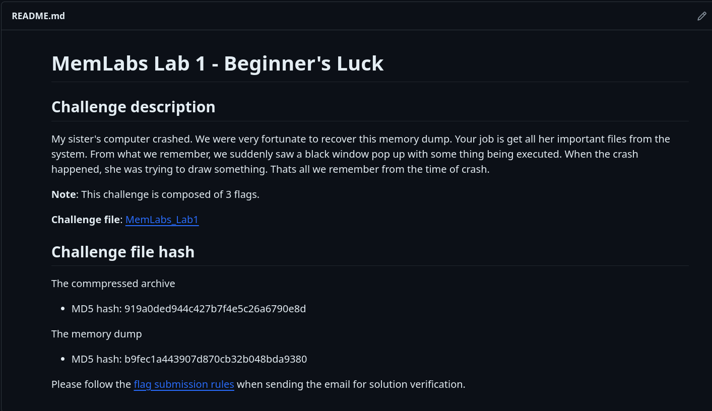
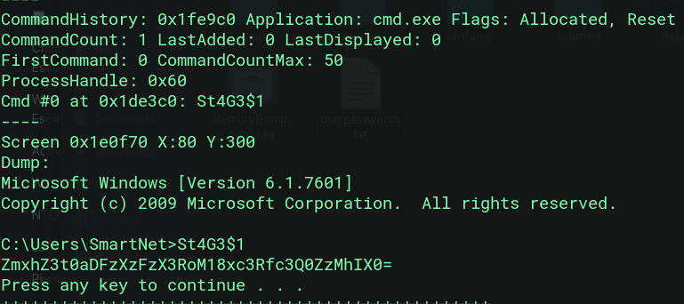
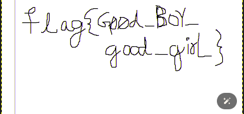

# Writeup MemLabs1

# MemLabs Lab 1 - Beginners’s Luck



Check out the chall files from : https://github.com/stuxnet999/MemLabs

### So lets start analysing the file!

To start with we us the imageinfo command in volatility2 to find the
basic info about the given memory dump.

```bash
python2 vol.py -f < filename > imageinfo
```

And we get the **profile suggesions** of the given
memory dump which is useful for the further commands we are using.

Now we can list out the processes by name from the memorydump using
the command:

```bash
python2 vol.py -f < filename > --profile=< profile > pslist
```

Now we see all the process’ run in the given file.

As said in the description they saw a blackwindow popup with
somthings being executed and the user was trying to fraw something.

from the pslist we see **mspaint.exe**

> Commands executed in cmd.exe are managed by conhost.exe (or csrss.exe
on systems before Windows 7). This means that if cmd.exe is terminated
by an attacker before a memory dump is obtained, it’s still possible to
recover the session’s command history from the memory of conhost.exe
> 

So to see the commandline arguments and command history we use

```bash
python2 vol.py --profile=PROFILE cmdline -f < file name > #Display process command-line argumentspython2 vol.py --profile=PROFILE consoles -f < filename > #command history
```

from the consoles we get to see a weird text:



The text is a base64 encoded text
and on decodong

```
ZmxhZ3t0aDFzXzFzX3RoM18xc3Rfc3Q0ZzMhIX0=
```

we
get the first flag >###

```
flag{th1s_1s_th3_1st_st4g3!!}
```

Now on searching for finding data from mspaint.exe We try to dum the
file using :

```bash
python2 ../vol.py --profile=Win7SP1x64 memdump  -f MemoryDump_Lab1.raw -p 2424 --dump-dir=.
```

We now open the raw data in gimp and on changing the offset and
changing some width we get a mirrored and inverted flag which in
correction gives



Now for the last part we use a filescan on the memorydump using

```bash
python2 vol.py --profile=Win7SP1x86_23418 filescan -f < filename >
```

We see a file called Important.rar from the filescan which can be
extracted using the following command

```bash
python2 ../vol.py --profile=Win7SP1x64 dumpfiles -n --dump-dir=. -Q < offset > -f MemoryDump_Lab1.raw
```

Now the extraced rar file is password protect on looking at the hex
we can see that .

```
Password is NTLM hash(in uppercase) of Alissa's account passwd
```

We can get the users password from the command

```bash
python2 ../vol.py --profile=Win7SP1x64 hashdump -f MemoryDump_Lab1.raw
```

To get the hashes:

```
Administrator:500:aad3b435b51404eeaad3b435b51404ee:31d6cfe0d16ae931b73c59d7e0c089c0:::
Guest:501:aad3b435b51404eeaad3b435b51404ee:31d6cfe0d16ae931b73c59d7e0c089c0:::
SmartNet:1001:aad3b435b51404eeaad3b435b51404ee:4943abb39473a6f32c11301f4987e7e0:::
HomeGroupUser$:1002:aad3b435b51404eeaad3b435b51404ee:f0fc3d257814e08fea06e63c5762ebd5:::
Alissa Simpson:1003:aad3b435b51404eeaad3b435b51404ee:f4ff64c8baac57d22f22edc681055ba6:::
```

On entering `f4ff64c8baac57d22f22edc681055ba6` in caps we
get the last part of the challenge

