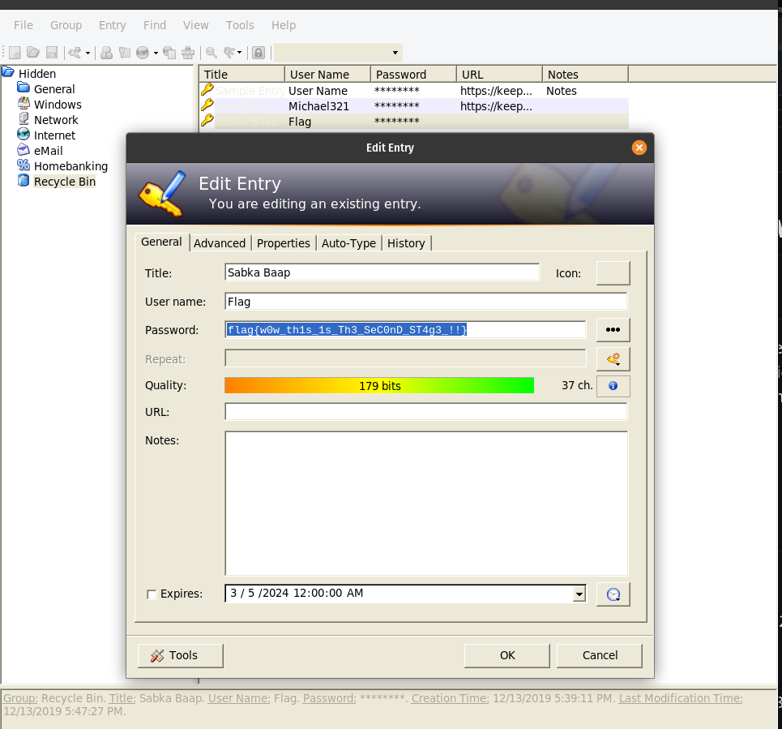

# Writeup-Memlabs2

# MemLabs Lab 2 - A New World


Check out this challenge at : https://github.com/stuxnet999/MemLabs

 To start with the lab in the description it is given certain keywords
 ` environmental `  activist

> browsers and password managers were his go to applications.
> 

So lets start ! ### PART 1

As soon as i saw environmental activists after finding the version of
the file using image info and the command

```bash
python2 vol.py imageinfo -f file.dmp
```

After getting the profile and image info of the memory dump i
searched for the environmental variables of each running process in the
memory dump

Note:

```
Environment variables are predetermined values that are typically used to provide the ability to configure a value in your code from outside of your application
```

I did this with the help of a command in volatility 2 using the
command

```bash
python2 vol.py --profile=PROFILE envars -f file.dmp
```

On doing that we get to see a weird text

```
 NEW_TMP C:\Windows\ZmxhZ3t3M2xjMG0zX1QwXyRUNGczXyFfT2ZfTDRCXzJ9
```

on decoding `ZmxhZ3t3M2xjMG0zX1QwXyRUNGczXyFfT2ZfTDRCXzJ9`
encoded with base64 we get the first part of the flag

```
flag{w3lc0m3_T0_$T4g3_!_Of_L4B_2}
```

### PART 2 The next approcah was to check for browser application
data and password managers in the memory dump .

We can use this command to store the data for all the files found
inside the memory dump

```bash
python2 vol.py --profile=PROFILE filescan -f file.dmp > filescan.txt
```

To find the internet history of the memory dump we can use the
command

```bash
python2 vol.py --profile=PROFILE iehistory -f file.dmp
```

On running the above command we can see

```
Volatility Foundation Volatility Framework 2.6.1
**************************************************
Process: 1064 explorer.exe
Cache type "URL " at 0x40a5000
Record length: 0x100
Location: Visited: Alissa Simpson@file:///C:/Users/Alissa%20Simpson/Documents/Important.rar
Last modified: 2019-12-11 14:37:23 UTC+0000
Last accessed: 2019-12-11 14:37:23 UTC+0000
File Offset: 0x100, Data Offset: 0x0, Data Length: 0xbc
**************************************************
Process: 1064 explorer.exe
Cache type "URL " at 0x40a5100
Record length: 0x100
Location: Visited: Alissa Simpson@file:///C:/Users/Alissa%20Simpson/Downloads/SW1wb3J0YW50.rar
Last modified: 2019-12-11 10:03:48 UTC+0000
Last accessed: 2019-12-11 10:03:48 UTC+0000
File Offset: 0x100, Data Offset: 0x0, Data Length: 0xc0
**************************************************
Process: 1064 explorer.exe
Cache type "URL " at 0x40a5200
Record length: 0x100
Location: Visited: Alissa Simpson@https://notifier.rarlab.com/?language=English&source=RARLAB&landingpage=first&version=580&architecture=64
Last modified: 2019-12-11 10:03:52 UTC+0000
Last accessed: 2019-12-11 10:03:52 UTC+0000
File Offset: 0x100, Data Offset: 0x0, Data Length: 0xec
**************************************************
Process: 1064 explorer.exe
Cache type "URL " at 0x40a5300
Record length: 0x100
Location: Visited: Alissa Simpson@file:///C:/Users/Alissa%20Simpson/stAg3_5.txt
Last modified: 2019-12-11 10:04:00 UTC+0000
Last accessed: 2019-12-11 10:04:00 UTC+0000
File Offset: 0x100, Data Offset: 0x0, Data Length: 0xb0
**************************************************
Process: 1064 explorer.exe
Cache type "URL " at 0x40a5400
Record length: 0x100
Location: Visited: Alissa Simpson@file:///C:/Users/Alissa%20Simpson/Pictures/Password.png
Last modified: 2019-12-14 10:37:41 UTC+0000
Last accessed: 2019-12-14 10:37:41 UTC+0000
File Offset: 0x100, Data Offset: 0x0, Data Length: 0xb8
**************************************************
Process: 1064 explorer.exe
Cache type "URL " at 0x40a5500
Record length: 0x100
Location: Visited: Alissa Simpson@file:///C:/Users/SmartNet/Secrets/Hidden.kdbx
Last modified: 2019-12-13 14:17:05 UTC+0000
Last accessed: 2019-12-13 14:17:05 UTC+0000
File Offset: 0x100, Data Offset: 0x0, Data Length: 0xb0
**************************************************
Process: 1064 explorer.exe
Cache type "URL " at 0x40a5600
Record length: 0x100
Location: Visited: Alissa Simpson@file:///C:/Users/SmartNet/Secrets/Hidden.kdbx
Last modified: 2019-12-14 10:37:56 UTC+0000
Last accessed: 2019-12-14 10:37:56 UTC+0000
File Offset: 0x100, Data Offset: 0x0, Data Length: 0xb0
**************************************************
Process: 1064 explorer.exe
Cache type "URL " at 0x44e5000
Record length: 0x100
Location: :2019121420191215: Alissa Simpson@file:///C:/Users/Alissa%20Simpson/Pictures/Password.png
Last modified: 2019-12-14 16:07:41 UTC+0000
Last accessed: 2019-12-14 10:37:41 UTC+0000
File Offset: 0x100, Data Offset: 0x0, Data Length: 0x0
**************************************************
Process: 1064 explorer.exe
Cache type "URL " at 0x44e5100
Record length: 0x100
Location: :2019121420191215: Alissa Simpson@:Host: Computer
Last modified: 2019-12-14 16:07:41 UTC+0000
Last accessed: 2019-12-14 10:37:41 UTC+0000
File Offset: 0x100, Data Offset: 0x0, Data Length: 0x0
**************************************************
Process: 1064 explorer.exe
Cache type "URL " at 0x44e5200
Record length: 0x100
Location: :2019121420191215: Alissa Simpson@file:///C:/Users/SmartNet/Secrets/Hidden.kdbx
Last modified: 2019-12-14 16:07:56 UTC+0000
Last accessed: 2019-12-14 10:37:56 UTC+0000
File Offset: 0x100, Data Offset: 0x0, Data Length: 0x0
**************************************************
Process: 2376 dllhost.exe
Cache type "URL " at 0x52d5000
Record length: 0x100
Location: Visited: Alissa Simpson@file:///C:/Users/Alissa%20Simpson/Documents/Important.rar
Last modified: 2019-12-11 14:37:23 UTC+0000
Last accessed: 2019-12-11 14:37:23 UTC+0000
File Offset: 0x100, Data Offset: 0x0, Data Length: 0xbc
**************************************************
Process: 2376 dllhost.exe
Cache type "URL " at 0x52d5100
Record length: 0x100
Location: Visited: Alissa Simpson@file:///C:/Users/Alissa%20Simpson/Downloads/SW1wb3J0YW50.rar
Last modified: 2019-12-11 10:03:48 UTC+0000
Last accessed: 2019-12-11 10:03:48 UTC+0000
File Offset: 0x100, Data Offset: 0x0, Data Length: 0xc0
**************************************************
Process: 2376 dllhost.exe
Cache type "URL " at 0x52d5200
Record length: 0x100
Location: Visited: Alissa Simpson@https://notifier.rarlab.com/?language=English&source=RARLAB&landingpage=first&version=580&architecture=64
Last modified: 2019-12-11 10:03:52 UTC+0000
Last accessed: 2019-12-11 10:03:52 UTC+0000
File Offset: 0x100, Data Offset: 0x0, Data Length: 0xec
**************************************************
Process: 2376 dllhost.exe
Cache type "URL " at 0x52d5300
Record length: 0x100
Location: Visited: Alissa Simpson@file:///C:/Users/Alissa%20Simpson/stAg3_5.txt
Last modified: 2019-12-11 10:04:00 UTC+0000
Last accessed: 2019-12-11 10:04:00 UTC+0000
File Offset: 0x100, Data Offset: 0x0, Data Length: 0xb0
**************************************************
Process: 2376 dllhost.exe
Cache type "URL " at 0x52d5400
Record length: 0x100
Location: Visited: Alissa Simpson@file:///C:/Users/Alissa%20Simpson/Pictures/Password.png
Last modified: 2019-12-14 10:37:41 UTC+0000
Last accessed: 2019-12-14 10:37:41 UTC+0000
File Offset: 0x100, Data Offset: 0x0, Data Length: 0xb8
**************************************************
Process: 2376 dllhost.exe
Cache type "URL " at 0x52d5500
Record length: 0x100
Location: Visited: Alissa Simpson@file:///C:/Users/SmartNet/Secrets/Hidden.kdbx
Last modified: 2019-12-13 14:17:05 UTC+0000
Last accessed: 2019-12-13 14:17:05 UTC+0000
File Offset: 0x100, Data Offset: 0x0, Data Length: 0xb0
**************************************************
Process: 2376 dllhost.exe
Cache type "URL " at 0x52d5600
Record length: 0x100
Location: Visited: Alissa Simpson@file:///C:/Users/SmartNet/Secrets/Hidden.kdbx
Last modified: 2019-12-14 10:37:56 UTC+0000
Last accessed: 2019-12-14 10:37:56 UTC+0000
File Offset: 0x100, Data Offset: 0x0, Data Length: 0xb0
```

Certain files like Hidden.kdbx which relates to the password manager
,Important.rar , Password.png were found.

To find the files from the memory dump and extract it we can find
their respective offsets from the filescan mentioned above

we extract the kdbx file using the command

```bash
python2 vol.py --profile=profile dumpfiles -n --dump-dir=/tmp -Q offset -f file.dmp
```

Now on renaming and opening the file using keepass it asks for a
master password to access the file inside

We get the master password for the kdbx file by extracting
password.png using the same command used above

```bash
python2 vol.py --profile=profile dumpfiles -n --dump-dir=/tmp -Q offset -f file.dmp
```

After extracting the png file and renaming it we get to see


with the password written in the bottom :


alt text

Entering this as the master password for the kdbx file we can access
the files inside and get the flag from the recycle bin



### PART 3

To start with we extract SW1wb3J0YW50.rar from the memory dump by
using the command

```bash
python2 vol.py --profile=profile dumpfiles -n --dump-dir=/tmp -Q offset -f file.dmp
```

Also `SW1wb3J0YW50` on base64 decode gives us the text
`Important`

The file present in the dumfile was `SW1wb3J0YW50.rar`
instead of `Important.rar`

Now on opening the file we see that the rar file was password
protectEd.

On opening the rar file in a hex editor we see a text in it that
says

```
Password is SHA1(stage-3-FLAG) from Lab-1. Password is in lowercase.
```

Now on entering the SHA1 hash of the stage3 flag of lab1 we get the
final flag of the challenge!!

