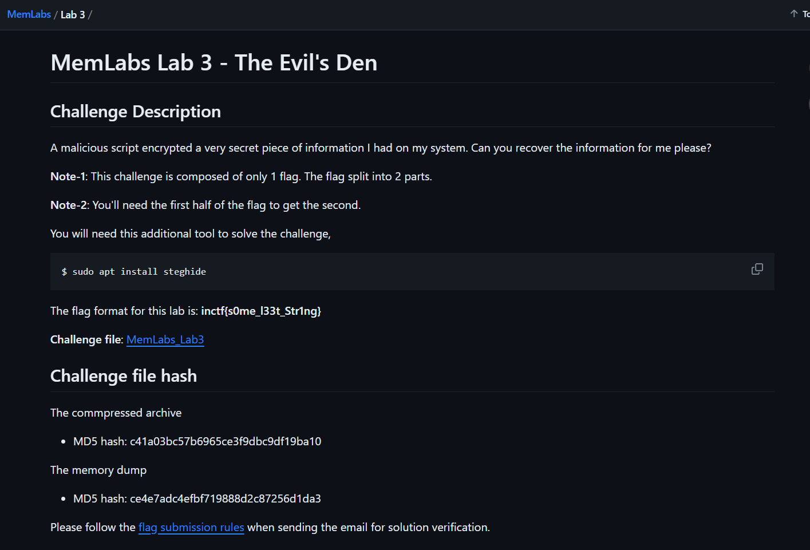

# Writeup - Memlabs3

# MemLabs Lab 3 - The Evil’s Den



Check out this challenge at : https://github.com/stuxnet999/MemLabs

Before we start with the memory analysis we look at the keypoints
given in the description Given >Flag split into 2 parts

> Acquire first flag in order to get the second
> 

So lets start with the challenge

First of all we find the imageinfo of the dumpfile using

```bash
python2 vol.py imageinfo -f file.dmp
```

After obtaining the necessary information about the os and the
profile we check for if anything suspicious was executed using the
command

```bash
python2 vol.py -f file.dmp --profile=PROFILE cmdline
```

we get to see that

```
Volatility Foundation Volatility Framework 2.6.1
************************************************************************
System pid:      4
************************************************************************
smss.exe pid:    260
Command line : \SystemRoot\System32\smss.exe
************************************************************************
csrss.exe pid:    340
Command line : %SystemRoot%\system32\csrss.exe ObjectDirectory=\Windows SharedSection=1024,12288,512 Windows=On SubSystemType=Windows ServerDll=basesrv,1 ServerDll=winsrv:UserServerDllInitialization,3 ServerDll=winsrv:ConServerDllInitialization,2 ServerDll=sxssrv,4 ProfileControl=Off MaxRequestThreads=16
************************************************************************
csrss.exe pid:    380
Command line : %SystemRoot%\system32\csrss.exe ObjectDirectory=\Windows SharedSection=1024,12288,512 Windows=On SubSystemType=Windows ServerDll=basesrv,1 ServerDll=winsrv:UserServerDllInitialization,3 ServerDll=winsrv:ConServerDllInitialization,2 ServerDll=sxssrv,4 ProfileControl=Off MaxRequestThreads=16
************************************************************************
wininit.exe pid:    388
Command line : wininit.exe
************************************************************************
winlogon.exe pid:    424
Command line : winlogon.exe
************************************************************************
services.exe pid:    484
Command line : C:\Windows\system32\services.exe
************************************************************************
lsass.exe pid:    492
Command line : C:\Windows\system32\lsass.exe
************************************************************************
lsm.exe pid:    500
Command line : C:\Windows\system32\lsm.exe
************************************************************************
svchost.exe pid:    588
Command line : C:\Windows\system32\svchost.exe -k DcomLaunch
************************************************************************
VBoxService.ex pid:    648
Command line : C:\Windows\System32\VBoxService.exe
************************************************************************
svchost.exe pid:    712
Command line : C:\Windows\system32\svchost.exe -k RPCSS
************************************************************************
svchost.exe pid:    800
Command line : C:\Windows\System32\svchost.exe -k LocalServiceNetworkRestricted
************************************************************************
svchost.exe pid:    852
Command line : C:\Windows\System32\svchost.exe -k LocalSystemNetworkRestricted
************************************************************************
svchost.exe pid:    880
Command line : C:\Windows\system32\svchost.exe -k LocalService
************************************************************************
svchost.exe pid:    904
Command line : C:\Windows\system32\svchost.exe -k netsvcs
************************************************************************
svchost.exe pid:   1236
Command line : C:\Windows\system32\svchost.exe -k NetworkService
************************************************************************
spoolsv.exe pid:   1340
Command line : C:\Windows\System32\spoolsv.exe
************************************************************************
svchost.exe pid:   1368
Command line : C:\Windows\system32\svchost.exe -k LocalServiceNoNetwork
************************************************************************
svchost.exe pid:   1488
Command line : C:\Windows\System32\svchost.exe -k utcsvc
************************************************************************
svchost.exe pid:   1516
Command line : C:\Windows\system32\svchost.exe -k LocalServiceAndNoImpersonation
************************************************************************
LogonUI.exe pid:    876
Command line : "LogonUI.exe" /flags:0x1
************************************************************************
sppsvc.exe pid:    292
Command line : C:\Windows\system32\sppsvc.exe
************************************************************************
svchost.exe pid:    440
Command line : C:\Windows\System32\svchost.exe -k secsvcs
************************************************************************
SearchIndexer. pid:   1184
Command line : C:\Windows\system32\SearchIndexer.exe /Embedding
************************************************************************
taskhost.exe pid:   4816
Command line : "taskhost.exe"
************************************************************************
dwm.exe pid:   3028
Command line : "C:\Windows\system32\Dwm.exe"
************************************************************************
explorer.exe pid:   5300
Command line : C:\Windows\Explorer.EXE
************************************************************************
VBoxTray.exe pid:   3064
Command line : "C:\Windows\System32\VBoxTray.exe"
************************************************************************
wuauclt.exe pid:   5644
Command line : "C:\Windows\system32\wuauclt.exe"
************************************************************************
msiexec.exe pid:   1016
Command line : C:\Windows\system32\msiexec.exe /V
************************************************************************
msiexec.exe pid:   5652
************************************************************************
TrustedInstall pid:   4724
Command line : C:\Windows\servicing\TrustedInstaller.exe
************************************************************************
audiodg.exe pid:   5996
Command line : C:\Windows\system32\AUDIODG.EXE 0x830
************************************************************************
SearchProtocol pid:   5748
Command line : "C:\Windows\system32\SearchProtocolHost.exe" Global\UsGthrFltPipeMssGthrPipe7_ Global\UsGthrCtrlFltPipeMssGthrPipe7 1 -2147483646 "Software\Microsoft\Windows Search" "Mozilla/4.0 (compatible; MSIE 6.0; Windows NT; MS Search 4.0 Robot)" "C:\ProgramData\Microsoft\Search\Data\Temp\usgthrsvc" "DownLevelDaemon"
************************************************************************
DumpIt.exe pid:   4116
Command line : "C:\Users\hello\Desktop\DumpIt\DumpIt.exe"
************************************************************************
conhost.exe pid:   3176
Command line : \??\C:\Windows\system32\conhost.exe "-578845771-1540166818332419906-659764396-174055078882731463-1164958248-211768531
************************************************************************
dllhost.exe pid:   1008
Command line : C:\Windows\system32\DllHost.exe /Processid:{76D0CB12-7604-4048-B83C-1005C7DDC503}
************************************************************************
SearchFilterHo pid:   4036
Command line : "C:\Windows\system32\SearchFilterHost.exe" 0 512 516 524 65536 520
************************************************************************
notepad.exe pid:   3736
Command line : "C:\Windows\system32\NOTEPAD.EXE" C:\Users\hello\Desktop\evilscript.py
************************************************************************
notepad.exe pid:   3432
Command line : "C:\Windows\system32\NOTEPAD.EXE" C:\Users\hello\Desktop\vip.txt
```

Some suspicious files like evilscript.py and vip.txt from it

We can extract these files by finding the files in the memory dump
along with their offsets using the command

```bash
python2 vol.py --profile=profile dumpfiles -n --dump-dir=/tmp -Q offset -f file.dmp
```

On opening `evilscript.py` we can see:

```python
import sys
import string
def xor(s):
    a = ''.join(chr(ord(i)^3) for i in s)
    return a
def encoder(x):
    return x.encode("base64")
if __name__ == "__main__":
    f = open("C:\\Users\\hello\\Desktop\\vip.txt", "w")
    arr = sys.argv[1]
    arr = encoder(xor(arr))
    f.write(arr)
    f.close()
```

and opening vip.txt we can see

```
am1gd2V4M20wXGs3b2U=
```

So on analysis we can understand that the text has undergone some
encoding and mangling which we have to reverse in order to get the
original text

on decoding the base64 and xoring it again we get the first half of
the flag

```
inctf{0n3_h4lf
```

Now i try looking for images as the description mentioned about
steghide

Command for filescan

```bash
python2 vol.py --profile=PROFILE filescan -f file.dmp > filescan.txt
```

On looking at the IEhsitory i get to see

```
**************************************************
Process: 5300 explorer.exe
Cache type "URL " at 0x1d15a80
Record length: 0x100
Location: :2018093020181001: hello@file:///C:/Users/hello/Desktop/suspision1.jpeg
Last modified: 2018-09-30 15:15:53 UTC+0000
Last accessed: 2018-09-30 09:45:53 UTC+0000
File Offset: 0x100, Data Offset: 0x0, Data Length: 0x0
**************************************************
Process: 5300 explorer.exe
Cache type "URL " at 0x1d15b80
Record length: 0x100
Location: :2018093020181001: hello@file:///C:/Users/hello/Desktop/evilscript.py.py
Last modified: 2018-09-30 15:15:59 UTC+0000
Last accessed: 2018-09-30 09:45:59 UTC+0000
File Offset: 0x100, Data Offset: 0x0, Data Length: 0x0
**************************************************
Process: 5300 explorer.exe
Cache type "URL " at 0x1d15c80
Record length: 0x100
Location: :2018093020181001: hello@file:///C:/Users/hello/Desktop/vip.txt
Last modified: 2018-09-30 15:17:50 UTC+0000
Last accessed: 2018-09-30 09:47:50 UTC+0000
File Offset: 0x100, Data Offset: 0x0, Data Length: 0x0
```

Searching for the jpeg from filescan to find the offset so that it
can be extracted using

```python
python2 vol.py --profile=profile dumpfiles -n --dump-dir=/tmp -Q offset -f file.dmp
```

we get the image :


On using steghide and the first half of the flag as password we get
the rest of the flag `_1s_n0t_3n0ugh}`

`Flag:`

```
inctf{0n3_h4lf_1s_n0t_3n0ugh}
```