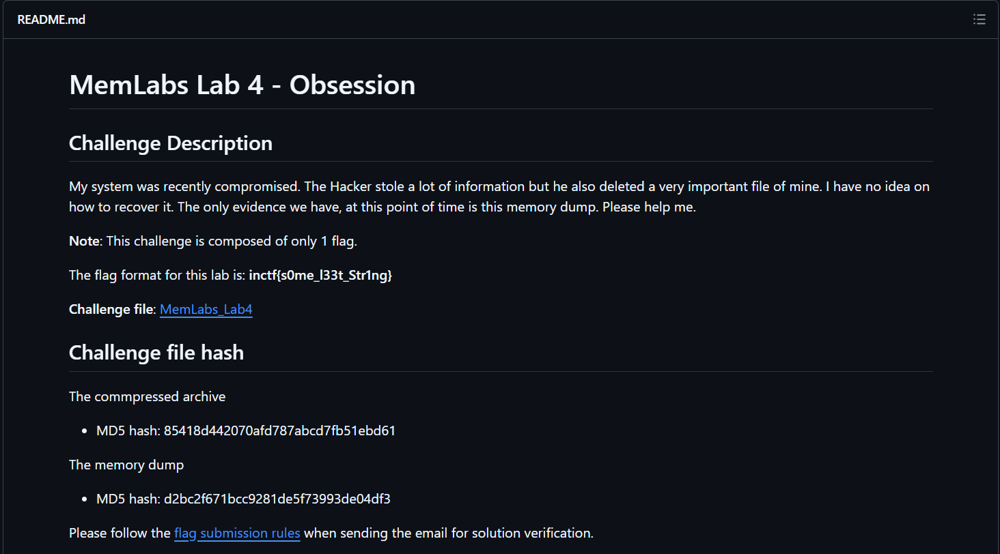
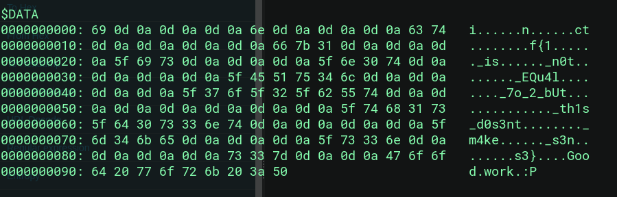

# Writeup-Memlabs4

# MemLabs Lab 4



Check out this challenge at : https://github.com/stuxnet999/MemLabs

Before starting with the challenge we are asked to find the deleted
file which was deleted by an hacker. So to start with i tried looking a
lot on how to recover deleted files from a memorydump

So to start with the challenge we first fine the OS version name and
profile info

using the command
`bash python2 vol.py -f file.dmp imageinfo`

On searching for a bit i found about Master File Tables(MFTs)

```
In NTFS, all of the metadata is stored in the MFT. This includes names, dates, parent folder, etc. the occupied clusters are also stored in there in a structure called data runs. The clusters storing the file data hold only file data and there is no linked list that holds info about the next or previous cluster.

When a file is deleted (assuming a skip of the recycle bin), there is a single bit in the MFT record that gets turned off. The rest of that record stays in place exactly how it was otherwise. The metadata from a deleted file does not get wiped out until a new file needs to occupy that record slot with its metadata.
```

so looking up at volatility2 commands i came across

```bash
python2 vol.py --profile=Win7SP1x86_23418 mftparser -f file.dmp
```

```
The NTFS file system uses a critical component known as the master file table (MFT). This table includes at least one entry for every file on a volume, covering the MFT itself too. Vital details about each file, such as size, timestamps, permissions, and actual data, are encapsulated within the MFT entries or in areas external to the MFT but referenced by these entries.
```

On looking at the records weget :



```
Flag: inctf{1_is_n0t_EQu4l_70_2_bUt_this_d0s3nt_m4ke_s3ns3}
```

```
File recovery process can be briefly described as drive or folder scanning to find deleted entries in Master File Table (MFT) then for the particular deleted entry, defining clusters chain to be recovered and then copying contents of these clusters to the newly created file.

```