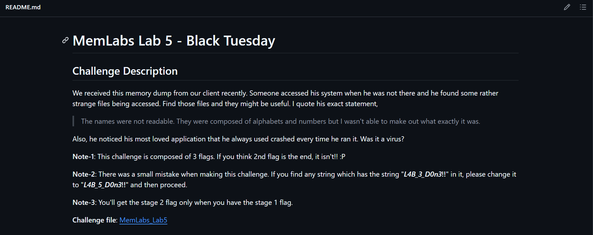
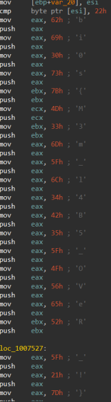

# Writeup-Memlabs5

# MemLabs Lab 5 - Black Tuesday



Before starting with the challenge lets read through the
description

> The names were not readable. They were composed of alphabets and
numbers but I wasn’t able to make out what exactly it was.
> 

> This challenge is composed of 3 flags. If you think 2nd flag is the
end, it isn’t!! :P
> 

> You’ll get the stage 2 flag only when you have the stage 1 flag.
> 

> his most loved application used to crash everytime he ran it.Was it a
virus? So lets start with the challenge
> 

First of all we find the imageinfo of the dumpfile using

```bash
python2 vol.py imageinfo -f file.dmp
```

To start with we try the commands pslist to list all the processes
out

```bash
python2 vol.py -f file.dmp --profile=PROFILE pslist
```

### Part1

We get the first flag for the challenge from the iehistory

```
Note :
IEHISTORY --> Recovers fragments of IE history index.dat cache files. It can find basic accessed links (via FTP or HTTP), redirected links (--REDR), and deleted entries (--LEAK). It applies to any process which loads and uses the wininet.dll library, not just Internet Explorer. Typically that includes Windows Explorer and even malware samples
```

Command reference:

```bash
python2 vol.py -f file.dmp --profile=PROFILE iehistory
```

Giving us

```
Cache type "URL " at 0x28c5900
Record length: 0x100
Location: Visited: Alissa Simpson@file:///C:/Users/Alissa%20Simpson/Pictures/ZmxhZ3shIV93M0xMX2QwbjNfU3Q0ZzMtMV8wZl9MNEJfM19EMG4zXyEhfQ.bmp
Last modified: 2019-12-19 08:35:18 UTC+0000
Last accessed: 2019-12-19 08:35:18 UTC+0000
File Offset: 0x100, Data Offset: 0x0, Data Length: 0xec
**************************************************
Process: 1396 explorer.exe
Cache type "URL " at 0x28c5a00
Record length: 0x100
Location: Visited: Alissa Simpson@file:///C:/Users/Alissa%20Simpson/Pictures/ZmxhZ3shIV93M0xMX2QwbjNfU3Q0ZzMtMV8wZl9MNEJfNV9EMG4zXyEhfQ.bmp
Last modified: 2019-12-20 03:46:09 UTC+0000
Last accessed: 2019-12-20 03:46:09 UTC+0000
File Offset: 0x100, Data Offset: 0x0, Data Length: 0xec
**************************************************
Process: 1396 explorer.exe
Cache type "URL " at 0x28c5b00
Record length: 0x100
Location: Visited: Alissa Simpson@file:///C:/Users/SmartNet/SW1wb3J0YW50.rar
Last modified: 2019-12-19 08:36:16 UTC+0000
Last accessed: 2019-12-19 08:36:16 UTC+0000
File Offset: 0x100, Data Offset: 0x0, Data Length: 0xac
**************************************************
Process: 1396 explorer.exe
Cache type "URL " at 0x28c5c00
Record length: 0x100
Location: Visited: Alissa Simpson@file:///C:/Windows/AppPatch/ZmxhZ3shIV93M0xMX2QwbjNfU3Q0ZzMtMV8wZl9MNEJfNV9EMG4zXyEhfQ.bmp
Last modified: 2019-12-20 03:46:37 UTC+0000
Last accessed: 2019-12-20 03:46:37 UTC+0000
File Offset: 0x100, Data Offset: 0x0, Data Length: 0xdc
**************************************************
Process: 1396 explorer.exe
Cache type "URL " at 0x2955000
Record length: 0x100
Location: :2019122020191221: Alissa Simpson@file:///C:/Windows/AppPatch/ZmxhZ3shIV93M0xMX2QwbjNfU3Q0ZzMtMV8wZl9MNEJfNV9EMG4zXyEhfQ.bmp
Last modified: 2019-12-20 09:16:37 UTC+0000
Last accessed: 2019-12-20 03:46:37 UTC+0000
File Offset: 0x100, Data Offset: 0x0, Data Length: 0x0
**************************************************
Process: 1396 explorer.exe
Cache type "URL " at 0x2955100
Record length: 0x100
Location: :2019122020191221: Alissa Simpson@:Host: Computer
Last modified: 2019-12-20 09:14:56 UTC+0000
Last accessed: 2019-12-20 03:44:56 UTC+0000
File Offset: 0x100, Data Offset: 0x0, Data Length: 0x0
**************************************************
Process: 1396 explorer.exe
Cache type "URL " at 0x2955200
Record length: 0x100
Location: :2019122020191221: Alissa Simpson@file:///C:/Users/Alissa%20Simpson/Pictures/ZmxhZ3shIV93M0xMX2QwbjNfU3Q0ZzMtMV8wZl9MNEJfNV9EMG4zXyEhfQ.bmp
Last modified: 2019-12-20 09:16:09 UTC+0000
Last accessed: 2019-12-20 03:46:09 UTC+0000
File Offset: 0x100, Data Offset: 0x0, Data Length: 0x0
**************************************************
Process: 1396 explorer.exe
Cache type "DEST" at 0x635910f
Last modified: 2019-12-20 09:16:37 UTC+0000
Last accessed: 2019-12-20 03:46:38 UTC+0000
URL: Alissa Simpson@file:///C:/Windows/AppPatch/ZmxhZ3shIV93M0xMX2QwbjNfU3Q0ZzMtMV8wZl9MNEJfNV9EMG4zXyEhfQ.bmp
```

We see a certain string being repeated multiple times and on decoding
`ZmxhZ3shIV93M0xMX2QwbjNfU3Q0ZzMtMV8wZl9MNEJfNV9EMG4zXyEhfQ`
we get the first flag for the challenge

```
flag{!!_w3LL_d0n3_St4g3-1_0f_L4B_5_D0n3_!!}
```

### Part2

We try what were the commands executed in the cmd using the
command

```bash
python2 vol.py -f file.dmp --profile=PROFILE cmdline
```

On trying cmdline we get

```
Volatility Foundation Volatility Framework 2.6.1
************************************************************************
System pid:      4
************************************************************************
smss.exe pid:    248
Command line : \SystemRoot\System32\smss.exe
************************************************************************
csrss.exe pid:    320
Command line : %SystemRoot%\system32\csrss.exe ObjectDirectory=\Windows SharedSection=1024,20480,768 Windows=On SubSystemType=Windows ServerDll=basesrv,1 ServerDll=winsrv:UserServerDllInitialization,3 ServerDll=winsrv:ConServerDllInitialization,2 ServerDll=sxssrv,4 ProfileControl=Off MaxRequestThreads=16
************************************************************************
csrss.exe pid:    368
Command line : %SystemRoot%\system32\csrss.exe ObjectDirectory=\Windows SharedSection=1024,20480,768 Windows=On SubSystemType=Windows ServerDll=basesrv,1 ServerDll=winsrv:UserServerDllInitialization,3 ServerDll=winsrv:ConServerDllInitialization,2 ServerDll=sxssrv,4 ProfileControl=Off MaxRequestThreads=16
************************************************************************
psxss.exe pid:    376
Command line : %SystemRoot%\system32\psxss.exe
************************************************************************
winlogon.exe pid:    416
Command line : winlogon.exe
************************************************************************
wininit.exe pid:    428
Command line : wininit.exe
************************************************************************
services.exe pid:    484
Command line : C:\Windows\system32\services.exe
************************************************************************
lsass.exe pid:    492
Command line : C:\Windows\system32\lsass.exe
************************************************************************
lsm.exe pid:    500
Command line : C:\Windows\system32\lsm.exe
************************************************************************
svchost.exe pid:    588
Command line : C:\Windows\system32\svchost.exe -k DcomLaunch
************************************************************************
VBoxService.ex pid:    656
Command line : C:\Windows\System32\VBoxService.exe
************************************************************************
svchost.exe pid:    724
Command line : C:\Windows\system32\svchost.exe -k RPCSS
************************************************************************
svchost.exe pid:    820
Command line : C:\Windows\System32\svchost.exe -k LocalServiceNetworkRestricted
************************************************************************
svchost.exe pid:    856
Command line : C:\Windows\System32\svchost.exe -k LocalSystemNetworkRestricted
************************************************************************
svchost.exe pid:    880
Command line : C:\Windows\system32\svchost.exe -k netsvcs
************************************************************************
audiodg.exe pid:    968
Command line : C:\Windows\system32\AUDIODG.EXE 0x2a8
************************************************************************
svchost.exe pid:    340
Command line : C:\Windows\system32\svchost.exe -k LocalService
************************************************************************
svchost.exe pid:   1044
Command line : C:\Windows\system32\svchost.exe -k NetworkService
************************************************************************
spoolsv.exe pid:   1232
Command line : C:\Windows\System32\spoolsv.exe
************************************************************************
svchost.exe pid:   1272
Command line : C:\Windows\system32\svchost.exe -k LocalServiceNoNetwork
************************************************************************
svchost.exe pid:   1372
Command line : C:\Windows\system32\svchost.exe -k LocalServiceAndNoImpersonation
************************************************************************
TCPSVCS.EXE pid:   1416
Command line : C:\Windows\System32\tcpsvcs.exe
************************************************************************
taskhost.exe pid:   2012
Command line : "taskhost.exe"
************************************************************************
taskeng.exe pid:   1140
Command line : taskeng.exe {1CE5BA55-4ED9-45CF-89C9-63EFFA573860}
************************************************************************
dwm.exe pid:   1172
Command line : "C:\Windows\system32\Dwm.exe"
************************************************************************
explorer.exe pid:   1396
Command line : C:\Windows\Explorer.EXE
************************************************************************
VBoxTray.exe pid:    528
Command line : "C:\Windows\System32\VBoxTray.exe"
************************************************************************
SearchIndexer. pid:   1800
Command line : C:\Windows\system32\SearchIndexer.exe /Embedding
************************************************************************
wmpnetwk.exe pid:   1928
Command line : "C:\Program Files\Windows Media Player\wmpnetwk.exe"
************************************************************************
svchost.exe pid:   2296
Command line : C:\Windows\System32\svchost.exe -k LocalServicePeerNet
************************************************************************
WmiPrvSE.exe pid:   2572
Command line : C:\Windows\system32\wbem\wmiprvse.exe
************************************************************************
sppsvc.exe pid:   2940
Command line : C:\Windows\system32\sppsvc.exe
************************************************************************
svchost.exe pid:   1128
Command line : C:\Windows\System32\svchost.exe -k secsvcs
************************************************************************
dllhost.exe pid:    668
Command line : C:\Windows\system32\DllHost.exe /Processid:{76D0CB12-7604-4048-B83C-1005C7DDC503}
************************************************************************
SearchFilterHo pid:   2608
Command line : "C:\Windows\system32\SearchFilterHost.exe" 0 504 508 516 65536 512
************************************************************************
SearchProtocol pid:    628
Command line : "C:\Windows\system32\SearchProtocolHost.exe" Global\UsGthrFltPipeMssGthrPipe3_ Global\UsGthrCtrlFltPipeMssGthrPipe3 1 -2147483646 "Software\Microsoft\Windows Search" "Mozilla/4.0 (compatible; MSIE 6.0; Windows NT; MS Search 4.0 Robot)" "C:\ProgramData\Microsoft\Search\Data\Temp\usgthrsvc" "DownLevelDaemon"
************************************************************************
csrss.exe pid:   1988
Command line : %SystemRoot%\system32\csrss.exe ObjectDirectory=\Windows SharedSection=1024,20480,768 Windows=On SubSystemType=Windows ServerDll=basesrv,1 ServerDll=winsrv:UserServerDllInitialization,3 ServerDll=winsrv:ConServerDllInitialization,2 ServerDll=sxssrv,4 ProfileControl=Off MaxRequestThreads=16
************************************************************************
winlogon.exe pid:   2120
Command line : winlogon.exe
************************************************************************
taskhost.exe pid:   1968
Command line : "taskhost.exe"
************************************************************************
dwm.exe pid:   2360
Command line : "C:\Windows\system32\Dwm.exe"
************************************************************************
explorer.exe pid:   1580
Command line : C:\Windows\Explorer.EXE
************************************************************************
VBoxTray.exe pid:   2144
Command line : "C:\Windows\System32\VBoxTray.exe"
************************************************************************
WinRAR.exe pid:   2924
Command line : "C:\Program Files\WinRAR\WinRAR.exe" "C:\Users\SmartNet\Documents\SW1wb3J0YW50.rar"
************************************************************************
notepad.exe pid:   2744
Command line : "C:\Windows\system32\notepad.exe"
************************************************************************
DumpIt.exe pid:   2208
Command line : "C:\Users\SmartNet\Downloads\DumpIt\DumpIt.exe"
************************************************************************
conhost.exe pid:   2612
Command line : \??\C:\Windows\system32\conhost.exe
************************************************************************
NOTEPAD.EXE pid:   2724
Command line : "C:\Users\SmartNet\Videos\NOTEPAD.EXE"
************************************************************************
svchost.exe pid:   2632
Command line : C:\Windows\System32\svchost.exe -k WerSvcGroup
************************************************************************
WerFault.exe pid:   2716
Command line : C:\Windows\SysWOW64\WerFault.exe -u -p 2724 -s 156
************************************************************************
NOTEPAD.EXE pid:   1388
************************************************************************
WerFault.exe pid:    780
Command line : C:\Windows\SysWOW64\WerFault.exe -u -p 1388 -s 156
************************************************************************
NOTEPAD.EXE pid:   2056
************************************************************************
WerFault.exe pid:   2168

```

`C:\Users\SmartNet\Documents\SW1wb3J0YW50.rar` seemed
suspicious converting it to base64 came decoded as
`Important.rar`

We can extract it by checking if its there in the filescan of the
memorydump and then using its offset to extract it from the dump.

Command for filescan

```bash
python2 vol.py -f file.dmp --profile=PROFILE filescan > filescan.txt
```

We store it to a file so that we can grep the required data

Now we check for SW1wb3J0YW50.rar in the filescan and its there.

We extract the file out using the command

```bash
python2 vol.py --profile=profile dumpfiles -n --dump-dir=/tmp -Q offset -f file.dmp
```

We see that the rar file is protected with a password and as per the
description flag of part1 is the password for the rar file

We get to see the second flag from the rar file


### Part3

Now for the final part we see that from cmdline we see NOTEPAD.EXE
results in executing werfault.exe

also there exists another notepad.exe in the path

```
"C:\Windows\system32\notepad.exe"
```

whereas NOTEPAD.EXE is in

```
"C:\Users\SmartNet\Videos\NOTEPAD.EXE"
```

we extract the process using the command

```bash
python2 vol.py --profile=profile procdump --pid=pid -n --dump-dir=. -f file.dmp
```

`the main application itself crashes, causing a WerFault.exe process`

```
NOTE
procdump-->To dump a process's executable, use the procdump command. Optionally, pass the --unsafe or -u flags to bypass certain sanity checks used when parsing the PE header. Some malware will intentionally forge size fields in the PE header so that memory dumping tools fail.
```

we get the pid from the cmdline command executed before

```
NOTEPAD.EXE pid:   2724
Command line : "C:\Users\SmartNet\Videos\NOTEPAD.EXE"
```

Now on extracting the executable we analyse it in any
disassembler.Here i have used IDA for it.



We get to see the flag in the graph view itself to get the final part
of the challenge!

```
bi0s{M3m_l4B5_OVeR_!}
```