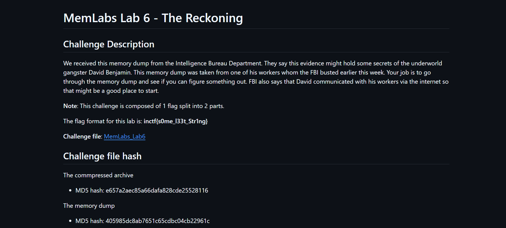

# Writeup-Memlabs6

# MemLabs Lab 6 - The Reckoning



Before starting with the challenge lets read through the
description

> The Key point mentioned was
he communicated with his workers via the internet
> 

So lets start,

First of all we find the imageinfo of the dumpfile using

```bash
python2 vol.py imageinfo -f file.dmp
```

The first thing i went for was for the iehistory to check whether any
evidence could be gathered from there

we can check that using the command

```bash
python2 vol.py -f file.dmp --profile=PROFILE iehistory
```

we get to see

```
**************************************************
Process: 1944 explorer.exe
Cache type "URL " at 0x5a58800
Record length: 0x100
Location: Visited: Jaffa@file:///C:/Users/Jaffa/Desktop/pr0t3ct3d/flag.zip
Last modified: 2019-08-18 11:34:57 UTC+0000
Last accessed: 2019-08-18 11:34:57 UTC+0000
File Offset: 0x100, Data Offset: 0x0, Data Length: 0xac
**************************************************
Process: 1944 explorer.exe
Cache type "URL " at 0x5a58900
Record length: 0x100
Location: Visited: Jaffa@file:///C:/Users/Jaffa/Desktop/pr0t3ct3d/flag.rar
Last modified: 2019-08-19 14:41:45 UTC+0000
Last accessed: 2019-08-19 14:41:45 UTC+0000
File Offset: 0x100, Data Offset: 0x0, Data Length: 0xac
**************************************************
Process: 1944 explorer.exe
Cache type "URL " at 0x5a58a00
Record length: 0x100
Location: Visited: Jaffa@https://notifier.win-rar.com/?language=English&source=wrr&landingpage=first&version=571&architecture=64
Last modified: 2019-08-18 11:42:16 UTC+0000
Last accessed: 2019-08-18 11:42:16 UTC+0000
File Offset: 0x100, Data Offset: 0x0, Data Length: 0xe0
**************************************************
Process: 1944 explorer.exe
Cache type "URL " at 0x5a58b00
Record length: 0x100
Location: Visited: Jaffa@file:///C:/Users/Jaffa/Desktop/pr0t3ct3d/flag.rar
Last modified: 2019-08-19 14:19:23 UTC+0000
Last accessed: 2019-08-19 14:19:23 UTC+0000
File Offset: 0x100, Data Offset: 0x0, Data Length: 0xac
**************************************************
Process: 1944 explorer.exe
Cache type "URL " at 0x5a45000
Record length: 0x100
Location: Cookie:jaffa@win-rar.com/
Last modified: 2019-08-18 11:42:18 UTC+0000
Last accessed: 2019-08-18 11:42:18 UTC+0000
File Offset: 0x100, Data Offset: 0x84, Data Length: 0x0
File: jaffa@win-rar[1].txt
**************************************************
Process: 1944 explorer.exe
Cache type "URL " at 0x5a45100
Record length: 0x100
Location: Cookie:jaffa@win-rar.com/
Last modified: 2019-08-18 11:42:18 UTC+0000
Last accessed: 2019-08-18 11:42:18 UTC+0000
File Offset: 0x100, Data Offset: 0x84, Data Length: 0x0
File: jaffa@win-rar[2].txt
```

So we find
`Jaffa@file:///C:/Users/Jaffa/Desktop/pr0t3ct3d/flag.rar`
from the iehistory

To extract the file we check whether we have it in filescan for the
given memory dump

To check the filescan we use the command

```bash
python2 vol.py -f file.dmp --profile=PROFILE filescan > filescan.txt
```

We store it to a file so that we can grep the required data

and i try to grep flag.rar and its there :)

So we extract the rar file using the command

```bash
python2 vol.py --profile=profile dumpfiles -n --dump-dir=/tmp -Q offset -f file.dmp
```

Now when we try to open the file we see its password protected

Trying to crack the rar file using john took some time.

Looks like we have the password for the rar file inside the memory
dump itself.

On searching for a bit i tried envars and got the password from it
giving us the second part of the flag !

command to check environmental variables

```bash
python2 vol.py --profile=PROFILE envars -f file.dmp
```

```
2968 firefox.exe   0x0000000000471320 RAR password                   easypeasyvirus
```

So the password for the rar file is `easypeasyvirus`.

Second part of the flag.


Now we start for the quest of finding the first part

extracting the chromehistory using filescan

```
0x000000005da5a610     15      1 RW-rw- \Device\HarddiskVolume2\Users\Jaffa\AppData\Local\Google\Chrome\User Data\Default\History
```

Going through the history we get to see a pastebin link in
between

```
https://pastebin.com/RSGSi1hk Private Paste ID: RSGSi1hk
```

on visiting the link we get to see

```
https://www.google.com/url?q=https://docs.google.com/document/d/1lptcksPt1l_w7Y29V4o6vkEnHToAPqiCkgNNZfS9rCk/edit?usp%3Dsharing&sa=D&source=hangouts&ust=1566208765722000&usg=AFQjCNHXd6Ck6F22MNQEsxdZo21JayPKug

But David sent the key in mail.

The key is... :(
```

The link inside the note leads to a word file with lots of random
data going through that we get to se a mega link in between

```
https://mega.nz/#!SrxQxYTQ
```

Which asks for a decryption key when trying to open it.

So we need to find the decryption key David sent via email

Also we get to see that the mega drive key is in the mail from the
screenshots plugin in volatility 2

```bash
python2 vol.py --profile=profile  screenshot -f file.dmp
```

Now after trying for a bit i tried strings on the dump file and
grepped `MEGA DRIVE` Using
`bash strings <filename> | grep -i 'MEGA DRIVE'`

we get

```jsx

https://mail.google.com/mail/u/0/#inbox/FMfcgxwDqnhdlrDxfJZXQvHMDdMQkgjtMega Drive Key - davidbenjamin939@gmail.com - Gmailmoc.elgoog.liam. https://mail.google.com/mail/u/0/#inbox/FMfcgxwDqnhdlrDxfJZXQvHMDdMQkgjtMega Drive Key - davidbenjamin939@gmail.com - Gmailmoc.elgoog.liam. https://mail.google.com/mail/u/0/#inbox/FMfcgxwDqnhdlrDxfJZXQvHMDdMQkgjtMega Drive Key - davidbenjamin939@gmail.com - Gmailmoc.elgoog.liam. https://mail.google.com/mail/u/0/#inbox/FMfcgxwDqnhdlrDxfJZXQvHMDdMQkgjtMega Drive Key - davidbenjamin939@gmail.com - Gmailmoc.elgoog.liam. O{"version":101,"tables":{"ads":[],"cluster_tombstones":[],"clusters":[{"c":{"1":"^io_unim","2":"^io_unim","7":1,"12":1000.0,"13":1,"18":1,"22":1,"24":1,"25":0},"f":0,"d":false,"a":1,"b":"^io_unim","g":"1254","h":1,"e":2},{"c":{"1":"^smartlabel_social","2":"^smartlabel_social","7":0,"12":1400.0,"13":1,"18":1,"21":1,"22":1,"24":1,"25":0},"f":0,"d":true,"a":2,"b":"^smartlabel_social","g":"1254","h":1,"e":2},{"c":{"1":"^all","2":"^all","7":1,"18":5,"21":1,"24":1,"25":0},"f":0,"d":false,"a":3,"b":"^all","g":"364","h":5,"e":2},{"c":{"1":"^smartlabel_travel","2":"^smartlabel_travel","7":0,"12":1700.0,"13":0,"18":1,"21":1,"22":1,"24":1,"25":0},"f":0,"d":true,"a":4,"b":"^smartlabel_travel","g":"1254","h":1,"e":2},{"c":{"1":"^smartlabel_notification","2":"^smartlabel_notification","7":1,"18":1,"21":1,"22":1,"24":1,"25":0},"f":0,"d":false,"a":5,"b":"^smartlabel_notification","g":"364","h":1,"e":2},{"c":{"1":"^smartlabel_group","2":"^smartlabel_group","7":1,"12":1200.0,"13":1,"18":1,"21":1,"22":1,"24":1,"25":0},"f":0,"d":false,"a":6,"b":"^smartlabel_group","g":"1254","h":1,"e":2},{"c":{"1":"^b","2":"^b","7":1,"18":5,"21":1,"24":1,"25":1},"f":0,"d":false,"a":7,"b":"^b","g":"364","h":5,"e":2},{"c":{"1":"^f","2":"^f","7":1,"18":5,"24":1,"25":0},"f":0,"d":false,"a":8,"b":"^f","g":"7","h":5,"e":2},{"c":{"1":"^i","2":"^i","7":1,"18":5,"24":0,"25":0},"f":0,"d":false,"a":9,"b":"^i","g":"7","h":5,"e":2},{"c":{"1":"^k","2":"^k","7":1,"18":5,"21":1,"24":1,"25":0},"f":0,"d":false,"a":10,"b":"^k","g":"364","h":5,"e":2},{"c":{"1":"^smartlabel_finance","2":"^smartlabel_finance","7":0,"12":1500.0,"13":1,"18":1,"21":1,"22":1,"24":1,"25":0},"f":0,"d":true,"a":11,"b":"^smartlabel_finance","g":"1254","h":1,"e":2},{"c":{"1":"^smartlabel_promo","2":"^smartlabel_promo","7":0,"12":1100.0,"13":1,"18":1,"21":1,"22":1,"24":1,"25":0},"f":0,"d":true,"a":12,"b":"^smartlabel_promo","g":"1254","h":1,"e":2},{"c":{"1":"^smartlabel_receipt","2":"^smartlabel_receipt","7":0,"12":1600.0,"13":1,"18":1,"21":1,"22":1,"24":1,"25":0},"f":0,"d":true,"a":13,"b":"^smartlabel_receipt","g":"1254","h":1,"e":2},{"c":{"1":"^r","2":"^r","7":1,"18":5,"24":1,"25":0},"f":0,"d":false,"a":14,"b":"^r","g":"7","h":5,"e":2},{"c":{"1":"^s","2":"^s","7":1,"18":5,"21":1,"24":1,"25":0},"f":0,"d":false,"a":15,"b":"^s","g":"364","h":5,"e":2},{"c":{"1":"^t","2":"^t","7":1,"18":5,"24":1,"25":0},"f":0,"d":false,"a":16,"b":"^t","g":"7","h":5,"e":2},{"c":{"1":"^io_im","2":"^io_im","7":1,"18":5,"21":1,"24":1,"25":0},"f":0,"d":false,"a":17,"b":"^io_im","g":"364","h":5,"e":2},{"c":{"1":"^scheduled","2":"^scheduled","7":1,"18":5,"21":3,"24":1,"25":0},"f":0,"d":false,"a":18,"b":"^scheduled","g":"7","h":5,"e":2},{"c":{"1":"^t_z","2":"^t_z","7":1,"18":5,"24":1,"25":0},"f":0,"d":false,"a":19,"b":"^t_z","g":"7","h":5,"e":2}],"entity_changes_to_sync_up":[],"entity_sync_state":[{"d":"0000001566225678320","e":"settings","c":null,"b":null,"a":1}],"filters":[],"items":[{"f":false,"d":{"1":{"1":"thread-f:1642300656742870683","2":"Mega Drive Key","3":"THE KEY IS zyWxCjCYYSEMA-hZe552qWVXiPwa5TecODbjnsscMIU","4":"1566219955932","10":0.9009061,"13":0,"16":"16ca9fbefb8cae9b"},"2":[{"1":"msg-f:1642300656742870683","2":{"1":1,"2":"danielbenjamin683@gmail.com","3":"Daniel Benjamin"},"3":"1566219955932","4":["^all","^i","^iim","^io_im","^io_lr","^o","^smartlabel_personal","^sq_ig_i_personal"],"7":"1566219956152","11":"THE KEY IS zyWxCjCYYSEMA-hZe552qWVXiPwa5TecODbjnsscMIU","15":{"3":{"1":3},"4":{"1":3},"5":{"1":0.9009061},"7":{"1":"21660255"},"8":[21660259,23130126,40510058,21660255,40510060,40510097,21660260],"10":1},"16":"1566219956152","22":0,"24":{"3":1},"28":"16ca9fbefb8cae9b"}]},"j":null,"i":"1642300656742870683","c":null,"e":null,"a":1,"b":"thread-f:1642300656742870683","h":"2379","g":4}],"item_changes":[],"item_messages":[{"i":false,"f":false,"c":1,"j":"1642300656742870683","h":null,"d":{"1":[{"1":1,"2":"davidbenjamin939@gmail.com"}],"5":"Mega Drive Key","6":{"2":[{"1":0,"3":{"2":"\u003cdiv dir\u003d\"ltr\"\u003eTHE KEY IS\u00a0\u003cb style\u003d\"color:rgb(38,50,56);font-family:Roboto,Arial,sans-serif;font-size:13pxd
from that we get the key for the mega drive link
```

`THE KEY IS zyWxCjCYYSEMA-hZe552qWVXiPwa5TecODbjnsscMIU`

and gives us the first part of the flag!!

